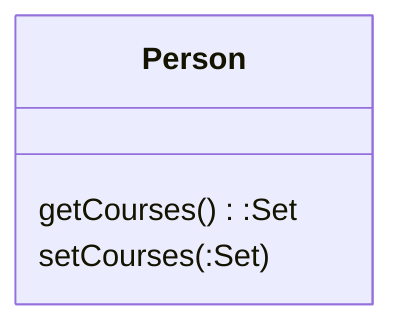
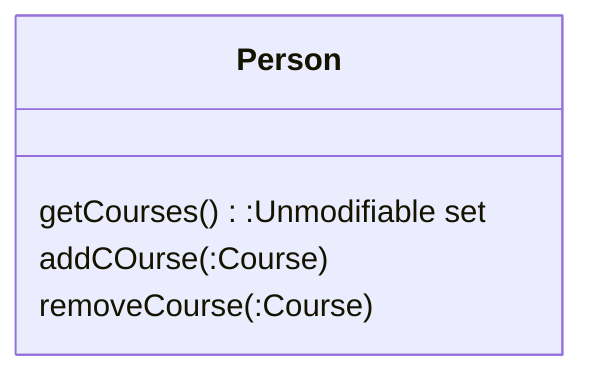

# (208)Encapsulate_Collection(封裝群集)

## 簡介說明

讓這個函式回傳該群集的一個唯讀映件(Real-only view)，並在這個class提供【新增/刪除】群集元素的函式



變成



## 動機

class 常常會使用array、list、set來保存實體資料，而如果有照著[(206)Encapsulate_Field(封裝欄位)]((206)Encapsulate_Field.md)也會有相對應的(getter/setter)

取值函式(getter)不應該回傳群集本身，這會讓其他人可以可以修改群集內容，而其他人卻不清楚

這就是對使用者暴露過多【物件內部資料結構】的資訊，如果確實是要回傳多個值，他應該避免用戶直接操作物件內保存的群集，並隱藏物件內【與使用者無關】的資料結構

也不應該對(setter)提供整個群集修改，但可以提供Add/Remove操作

如果以上幾點執行到，就可以很好的被封裝起來，降低群集與使用者的耦合度

## 範例

``` cs
class Person
{
    public List<Course> Courses {get;set;}
}

class Course
{
    public string Name {get;set;}
    public bool IsAdvanced {get;set;}
}

class simple_Example
{
    public void ManipulatingCourses()
    {
        var kent = new Person {Courses = new List<Course>()};
        kent.Courses.Add(new Course { Name = "Smalltalk programming" , IsAdvanced = false});
        kent.Courses.Add(new Course { Name = "Appreciatin Single Malts" , IsAdvanced = true});

        var refactoringCourse = new Course { Name = "Refactoring" , IsAdvanced = false};
        kent.Courses.Add(refactoringCourse);

        kent.Courses.Add( new Course { Name = "Brutal Sarcasm" , IsAdvanced = false});
        kent.Courses.Remove(refactoringCourse);
    }

    public void GettingCourseInfo()
    {
        var kent = new Person();
        var advancedCourses = kent.Courses.Count(c => c.IsAdvanced);
    }

}
```

``` cs
class Person
{
    // 步驟二：建立Private 並且get; private set;
    public List<Course> Courses {
     get {return _courses;}
     private set {_courses = value;}
    }

    // 步驟三；建構式新增
    public Person()
    {
        _courses = new List<Course>();
    }

    // 步驟一；新增Add
    public void AddCourse(Course course){
        Courses.Add(course);
    }

    // 步驟一；新增Remove
    public void RemoveCourse(Course course){
        Courses.Remove(course);
    }
}

class Course
{
    public string Name {get;set;}
    public bool IsAdvanced {get;set;}
}

class simple_Example
{
    public void ManipulatingCourses()
    {
        // 步驟二：這邊就會出錯，所以新增建構式(步驟三)
        //var kent = new Person{Courses = new List<Course>()};
        var kent = new Person();

        kent.Courses.Add(new Course { Name = "Smalltalk programming" , IsAdvanced = false});
        kent.Courses.Add(new Course { Name = "Appreciatin Single Malts" , IsAdvanced = true});

        var refactoringCourse = new Course { Name = "Refactoring" , IsAdvanced = false};
        kent.Courses.Add(refactoringCourse);

        kent.Courses.Add( new Course { Name = "Brutal Sarcasm" , IsAdvanced = false});
        kent.Courses.Remove(refactoringCourse);
    }

    public void GettingCourseInfo()
    {
        var kent = new Person();
        var advancedCourses = kent.Courses.Count(c => c.IsAdvanced);
    }

}

```

``` cs
class Person
{

    private List<Course> _courses;

    // 步驟四：我不想讓使用者看到Courses，設定Private
    // 而且不提供直接變更群集，所以把set拿掉
    // 並且get改用ReadOnly
    public IReadOnlyList<Course> Courses {
        get {return _courses.AsReadOnly();}
    }


    public Person()
    {
        _courses = new List<Course>();
    }


    public void AddCourse(Course course){
        // 步驟五：修改成_course
        _courses.Add(course);
    }


    public void RemoveCourse(Course course){
    // 步驟五：修改成_course
        _courses.Remove(course);

    }
}

    class Course
    {
        public string Name {get;set;}
        public bool IsAdvanced {get;set;}
    }

    class simple_Example
    {
    public void ManipulatingCourses()
    {
        var kent = new Person();

         // 步驟五：改用function
        kent.AddCourse(new Course { Name = "Smalltalk programming" , IsAdvanced = false});
        kent.AddCourse(new Course { Name = "Appreciatin Single Malts" , IsAdvanced = true});

        var refactoringCourse = new Course { Name = "Refactoring" , IsAdvanced = false};
         // 步驟五：改用function
        kent.AddCourse(refactoringCourse);

         // 步驟五：改用function
        kent.AddCourse( new Course { Name = "Brutal Sarcasm" , IsAdvanced = false});
        kent.RemoveCourse(refactoringCourse);
    }

    public void GettingCourseInfo()
    {
        var kent = new Person();
        var advancedCourses = kent.Courses.Count(c => c.IsAdvanced);
    }

}

```

### 後繼

封裝群集就如同206的[後繼]((206)Encapsulate_Field.md#)一樣就不再多說

還是要提醒，只針對有使用或修改的進行開放，其他都都進行封裝，才是對未來有幫助的Code

從設計模式學到重構，真心覺得重構才是對日常工作最有幫助的技能，把程式品質提高才真的是落實盡快下班的最快途徑