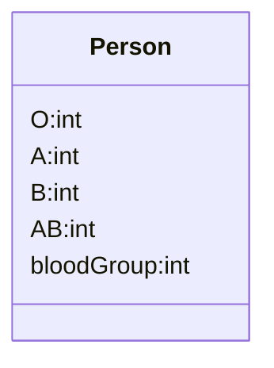
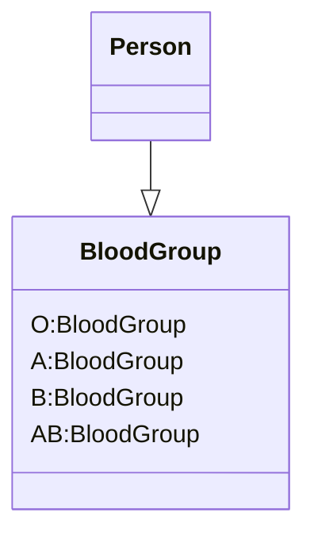

# (218)Replace_Type_Code_With_Class(類別取代型別代碼)

## 簡介說明

class之中有一個數值型別的代碼，但她不影響行為。

以一個新的class汰換該數值型別



變成



## 動機

C# 中其實還有Enum來取代類似得事情，都可以增加程式的可讀性

這篇的作法可以更嚴謹的提高對型別的檢驗。

但是在使用此方法之前，更應該先檢查是不是有使用Switch之類的語句來判斷

如果有建議先看看[(255)Conditional_With_Polymorphism(多型取代條件式)]((255)Conditional_With_Polymorphism.md#255conditional_with_polymorphism)去掉。

為了進行這樣的重構，你首先必須運用到[(223)Replace_Type_Code_with_Subclasses(已子類別取代型別代碼)]((223)Replace_Type_Code_with_Subclasses%20copy.md)或[(227)Replace_Type_Code_With_State_Strategy(State/Strategy取代型別代碼)]((227)Replace_Type_Code_With_State_Strategy.md)

把Type Code 去掉


## 範例

``` cs
class Person
{
    public static int O = 0;
    public static int A = 1;
    public static int B = 2;
    public static int AB = 3;

    public int BloodGroup {get; private set;}

    public Person(int bloodGroup)
    {
        BloodGroup = bloodGroup;
    }
}

```

改變成

```cs
class Person
{

    public BloodGroup BloodGroup {get;  set;}

    public Person(BloodGroup bloodGroup)
    {
        BloodGroup = bloodGroup;
    }
}

// 步驟一：
class BloodGroup
{
    public static BloodGroup O = new BloodGroup(0);
    public static BloodGroup A = new BloodGroup(1);
    public static BloodGroup B = new BloodGroup(2);
    public static BloodGroup AB = new BloodGroup(3);

    private int Code {get;  set;}

    private BloodGroup(int code)
    {
        Code = code;
    }
}

// Client Code
public void mytest()
{

    Person p = new Person(BloodGroup.A);
}
```

### 後繼

這類的優化其實我覺得無非就是滿足幾個重點

1. 將類似的東西Group起來，不論是使用Enum或是這邊的方法
2. 把要帶入的參數用Class或Enum代替，減少使用int或string的方式呈現，可以大大增加可讀性與擴充性，也可避點輸入錯誤)

這類的程式碼非常多處可以看見，看完這方法我大概的選擇會是幾個

如果這些特徵還有其他運算或是更複雜了我會用此方法，否則我直接用Enum先打完收工即可